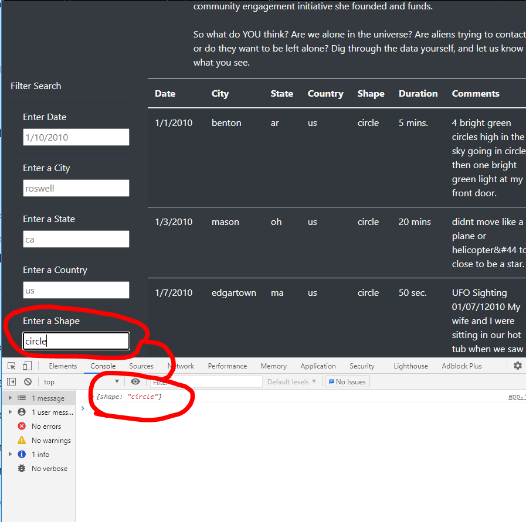
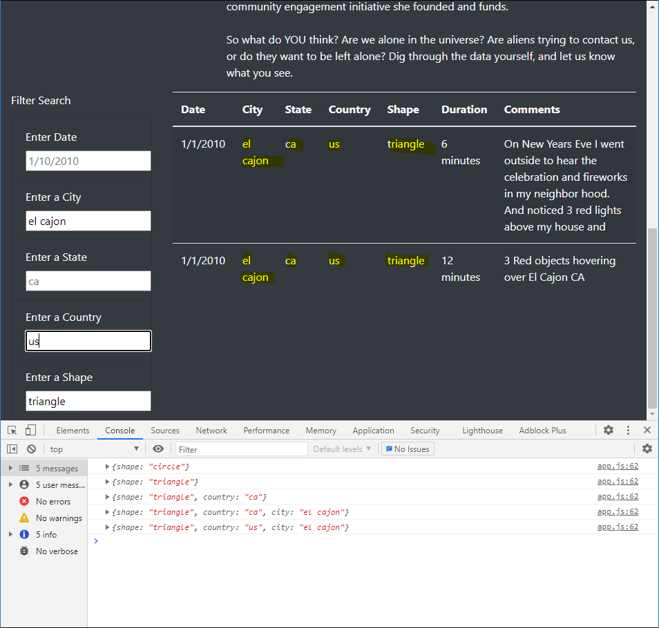

# UFO's

CU-VIRT-DATA-PT-02-2021-U-B-TTH - UFO Sightings with JavaScript - 11

Paul Do 2021/05/02

## Overview of Javascript to lookup UFO Sightings**

The purpose of this project is to filter a dataset of UFO sightings by none to 5 key parameters 

## Resource

Data Source, images: [data.js](static/js/data.js), [nasa.jpg](static/images/nasa.jpg)

Code files: [app.js](static/js/app.js), [style.css](static/css/style.css) 

Software: Google Chrome 90.0.4430.93 

## Results

Searches can easily be performed by typing in values in the Filter Search pane as shown in the first image below. The First Search was initiated by entering a Shape of circle and pressing enter, returning results based on a single parameter search

We can fine tune it and enter more information for searching, also in this case we entered the country code wrong below, but since the javascript is set to update on user input/correction in the below case we corrected circle with triangle, and then update country code as "ca" in error but we easily fix/change the country code to "us", finish the query without refreshing the webpage. The Developer console allows us to see the iterations of parameters on our searches as we go (except in a refresh, which would reset the console)

## Summary

One drawback of this webpage design is the columns are not sortable by one or more of the column headers. The data is presented in the order that it is stored into the data.js file, which means data out of order would also display out of order on the website. Another drawback of the coding as is is that it treats upper and lowercase as not being the same letter in the alphabet 

The first recommendation is to allow a minimum and maximum date date entry since we might be concerned with sightings over a period of time.

Another recommendation is to allow the user to select more than one column value, as we might be interested in a multiple state sighting like New York, New Jersey, and Connecticut where a sighting my be viewable on the border of states.